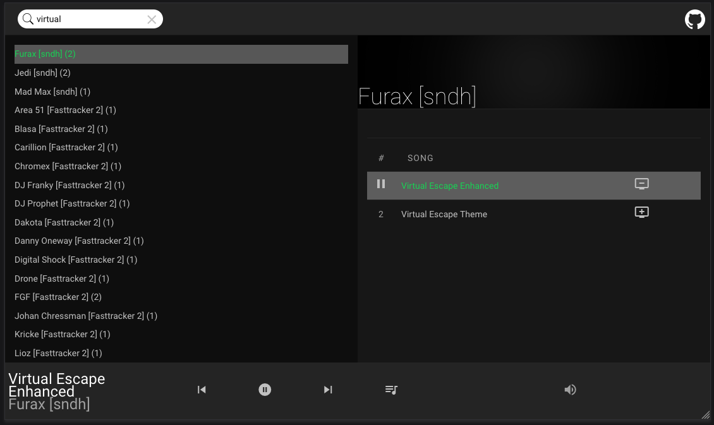

# Atari music jukebox



https://player.tornil.me/


## Based on NodePlayer
Modern WebAudio Module player, uses AudioWorklets

Supports:
- [libopnmpt](https://lib.openmpt.org/libopenmpt/) worklet processor (version 0.6.7, 2023-01-08)
  - emscripten worklet-compatible module... built manually. Will push that on a repository, on day
- [sc68](http://sc68.atari.org/index.html) worklet processor
  - emscripten worklet-compatible module from https://github.com/bobuss/sc68-2.2.1


## Resources and Inspirations

- design from https://codepen.io/alowenthal/pen/rxboRv
- icons from https://fonts.google.com/icons
- player from Juergen Wothke https://bitbucket.org/wothke/webaudio-player
  - sc68 backend: https://bitbucket.org/wothke/sc68-2.2.1/src/master/
  - ym backend: https://bitbucket.org/wothke/webym/src/master/
  - xmp backend: https://bitbucket.org/wothke/libxmp-4.4.1/src/master/
- ym player by https://github.com/nguillaumin/ym-jukebox
- sc68 replay bin files from https://github.com/DeaDBeeF-Player/deadbeef build
- YM resources https://github.com/simondotm/ym2149f/blob/master/doc/Resources.md
- sndh collection from http://sndh.atari.org/
- sc68 collection from http://sc68.atari.org/
- checked out https://github.com/demozoo/cowbell, but does not support multi-track songs
- https://github.com/bryc/ahx-web-player

Big up to Nectarine web radio: https://scenestream.net/demovibes/streams/


## Building the ST-Sound library Emscripten port

```
docker run --rm -v $PWD/stsound:/data -w /data emscripten/emsdk:latest emmake make clean libym.js
```


## TODO
- fixed width for player
- work on onTrackEnd functions
- more visible queue icon, maybe with visible info from the player
- work on multi-tracks songs
- save volume level
- move song within the queue
- more formats
- seek bar for formats which support it
